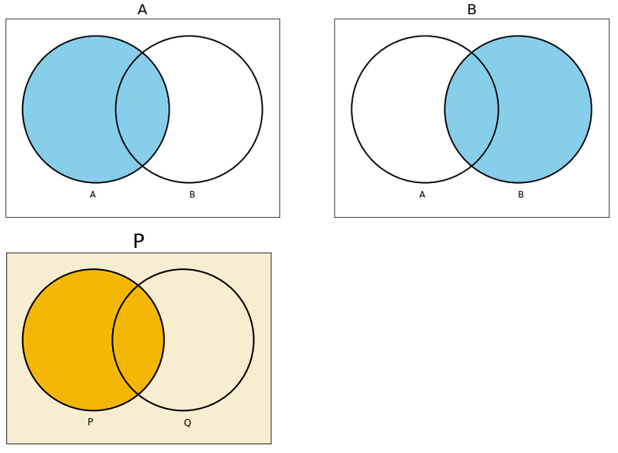
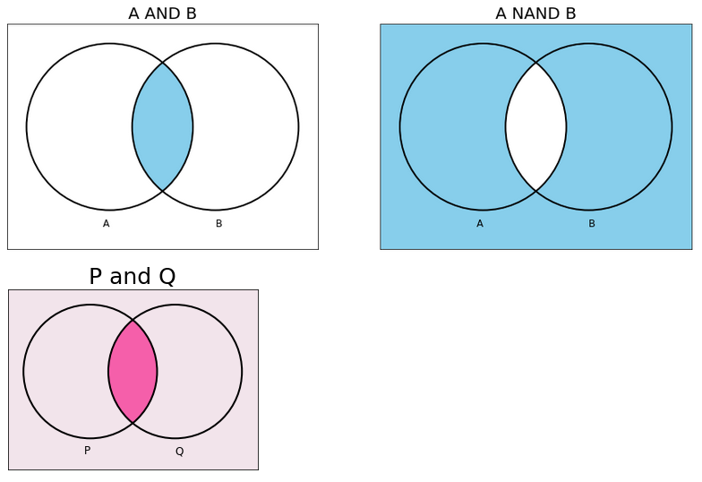

# vennfig

`vennfig` is a Python package and is a wrapper for [`matplotlib_venn`](https://github.com/konstantint/matplotlib-venn)

You can draw simple Venn diagrams with 2 lines of code.

## Installation:

```
pip install vennfig
```

On Jupyter:

```
!pip install vennfig
```

## Examples

### A, B

```
a_b()
a_b(subs=2, size=6, fill_color='#f5b705', bg_color='#f7edd0', 
    font_size=25, title_a='P', set_a='P', set_b='Q')
```



### A AND B, A NAND B

```
and_nand()
and_nand(subs=2, size=5, fill_color='#f55faa', bg_color='#f2e4eb', 
         font_size=25, title_a='P and Q', title_b='a nand b', set_a='P', set_b='Q')
```



